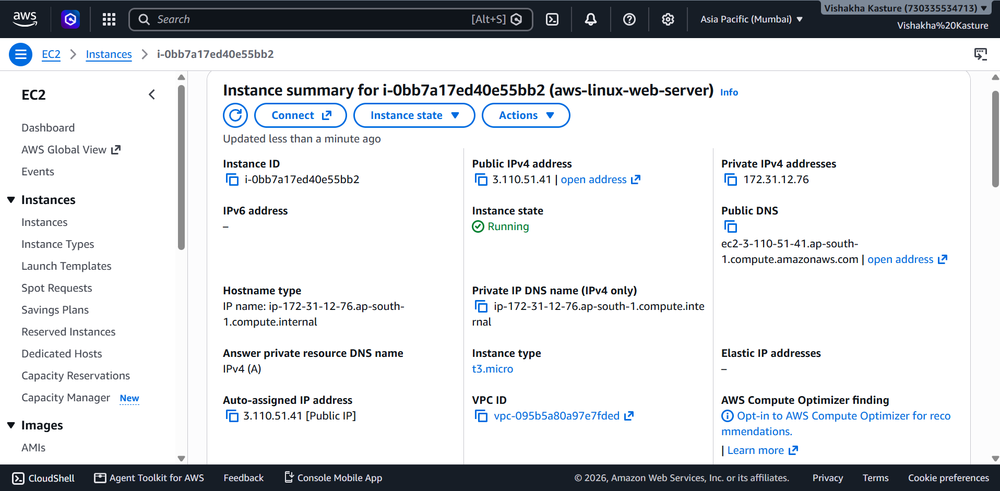
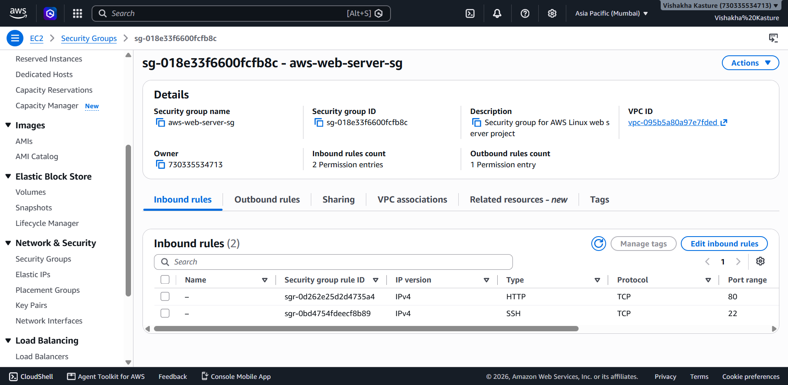
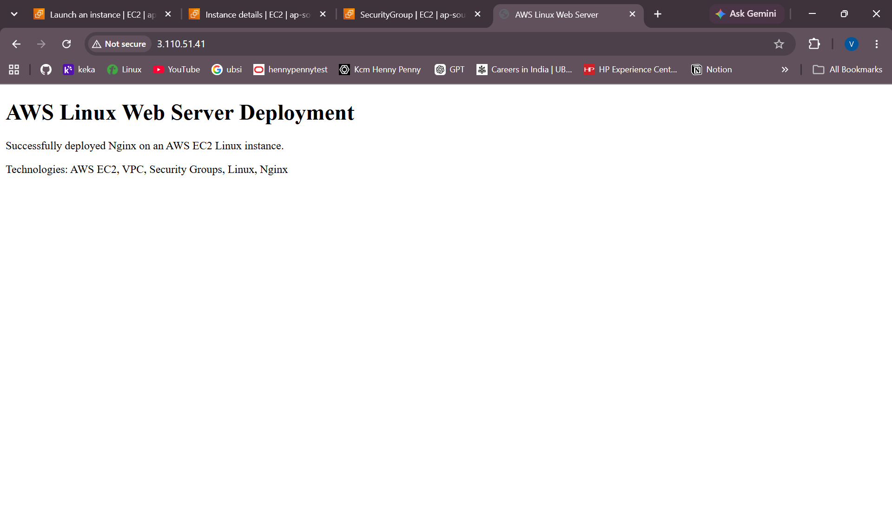

# AWS Linux Web Server Deployment

A hands-on AWS project demonstrating the deployment and configuration of a Linux-based Nginx web server using Amazon EC2.

## Technologies

- AWS EC2
- AWS VPC
- AWS Security Groups
- Ubuntu Linux
- Nginx
- SSH

## Project Overview

This project demonstrates the deployment of a Linux web server on Amazon EC2 and the configuration of AWS networking and security required to access the server remotely.

## Implementation

- Used the default AWS VPC and a public subnet.
- Launched an Ubuntu Linux EC2 instance.
- Configured a Security Group for SSH and HTTP access.
- Connected to the EC2 instance using SSH.
- Updated Ubuntu package information.
- Installed and configured Nginx.
- Created a custom HTML webpage.
- Tested the Nginx server locally using `curl`.
- Accessed the deployed webpage through the EC2 public IPv4 address.

## Security Group Configuration

| Protocol | Port | Source |
|----------|------|--------|
| SSH | 22 | My IP |
| HTTP | 80 | Anywhere IPv4 |

## Architecture

Internet
↓
AWS VPC
↓
Public Subnet
↓
EC2
↓
Ubuntu Linux
↓
Nginx
↓
Web Browser

## Screenshots

### EC2 Instance

### Security Group

### Nginx Web Server

## Result

Successfully deployed a Linux-based Nginx web server on AWS EC2 and hosted a custom HTML webpage accessible through the instance's public IPv4 address.

## Status

Completed
